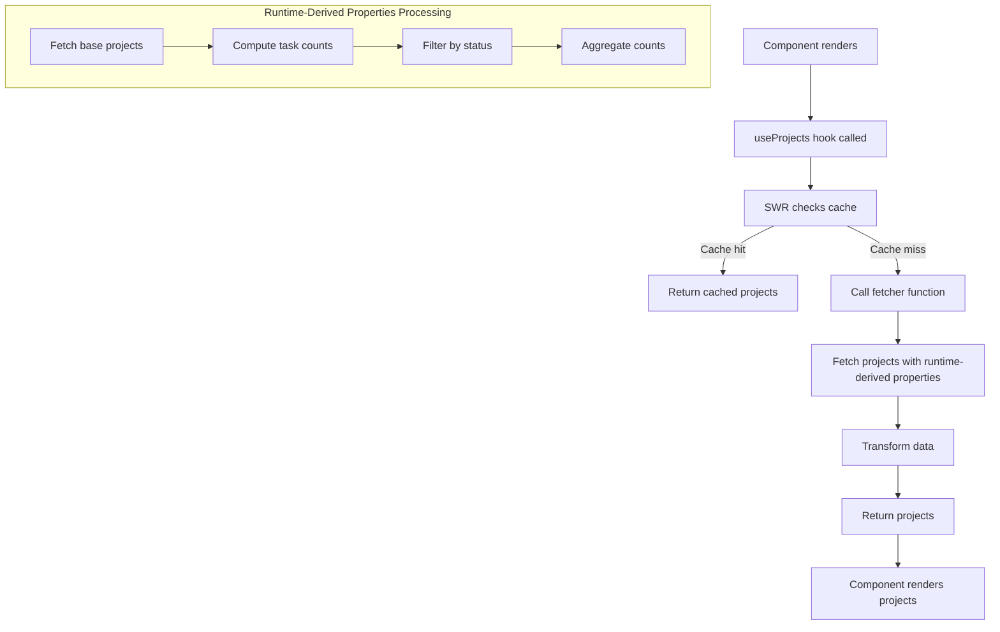

# useProjects hook

The `useProjects` hook provides a comprehensive interface for fetching and managing project data in the advanced to-do application, with an emphasis on calculating real-time task statistics. It leverages the Ontology SDK (OSDK) to interact with backend services in a type-safe manner, offering a clean interface for components to access project data along with aggregated task metrics.

This hook implements [runtime-derived properties](/docs/foundry/ontology/derived-properties/) to efficiently calculate task statistics for each project, such as the total number of tasks and their distribution across different status categories (completed, in progress, not started). By using SWR (stale-while-revalidate) for data fetching, it ensures optimized network requests while maintaining up-to-date data with configurable caching strategies.

[View the `useProjects` reference code.](/docs/foundry/ontology-sdk-react-applications/useprojects-tsx/)

## Key functions

* **Server-side aggregation:** Uses the runtime-derived properties pattern to perform server side aggregations, minimizing data transfer.
* **Type safety:** Ensures type safety throughout with TypeScript interfaces and OSDK type utilities.
* **Task status constants:** Uses constant objects for task statuses to prevent magic strings and improve code maintenance.
* **Error handling:** Implements robust error handling with try/catch and configurable retry mechanisms.
* **Performance optimization:** Configures SWR with custom options to optimize network requests and caching.
* **Clean return interface:** Provides a well-structured return object that components can easily consume.
* **Component-friendly data:** Transforms data into a format that is ready for component consumption without additional processing.

## `useProjects` structure

### Interface definition

```typescript
export type IProject = Osdk.Instance<AdvanceTodoProject, never, PropertyKeys<AdvanceTodoProject>> & {
  numberOfTasks: number,
  numberOfCompletedTasks: number,
  numberOfInProgressTasks: number,
  numberOfNotStartedTasks: number,
}
```

This interface combines the base project type from the SDK with additional properties for task statistics:

1. Uses `Osdk.Instance` to get the base type for project objects
2. Adds strongly-typed number properties for task statistics
3. Creates a unified type that components can use without worrying about the underlying implementation

### Data fetching

The `useProjects` hook uses SWR's data fetching capabilities with a custom fetcher function that does the following:

1. Uses runtime-derived properties to fetch projects with task statistics in a single request
2. Executes complex filtering and aggregation operations server-side
3. Maps the results to the expected interface format
4. Handles errors gracefully with try/catch

```typescript
const fetcher = useCallback(async () => {
  try {
    const projectsPage = await client(AdvanceTodoProject)
      .withProperties({
        // Runtime-derived property definitions for task counts
      })
      .fetchPage();
    
    const projects: IProject[] = projectsPage.data.map((project: ProjectWithRDP) => {
      return {
        ...project,
        numberOfTasks: project.numberOfTasks,
        numberOfCompletedTasks: project.numberOfCompletedTasks,
        numberOfInProgressTasks: project.numberOfInProgressTasks,
        numberOfNotStartedTasks: project.numberOfNotStartedTasks,
      };
    });
    
    return projects;
  } catch (error) {
    console.error("Error fetching projects:", error);
    return [];
  }
}, [client]);
```

### SWR configuration

The hook configures SWR with custom options to optimize performance:

```typescript
const { data, isLoading, isValidating, error } = useSWR<IProject[]>(
  "projects",
  fetcher,
  { 
    revalidateOnFocus: false,
    dedupingInterval: 10_000, // Avoid refetching within 10 seconds
    errorRetryCount: 3        // Retry failed requests up to 3 times
  }
);
```

As configured in the example above, these settings do the following:

* **`revalidateOnFocus`:** Disables automatic revalidation when the window regains focus.
* **`dedupingInterval`:** Implements a 10-second deduping interval to prevent redundant requests.
* **`errorRetryCount`:** Configures error retry behavior for better resilience.

### Return value

```typescript
{
  projects: data ?? [],        // Array of projects with task statistics
  isLoading: boolean,          // True during initial data loading
  isValidating: boolean,       // True during background revalidation
  isError: Error | undefined,  // Error object if the request failed
}
```

This clean interface gives components all the information they need to handle various states and render the appropriate UI.

## Implementation

### Runtime-derived properties

Runtime-derived properties are a powerful pattern that allows for computing and fetching only the data needed at runtime, rather than retrieving entire objects and computing values client-side.

In this hook, runtime-derived properties are used to calculate task statistics directly on the server:

```typescript
.withProperties({
  "numberOfTasks": (baseObjectSet) =>
    baseObjectSet.pivotTo("codingTasks").aggregate("$count").add(
    baseObjectSet.pivotTo("learningTasks").aggregate("$count")),
  "numberOfCompletedTasks": (baseObjectSet) =>
    baseObjectSet.pivotTo("codingTasks").where({
      "status": { $eq: TASK_STATUS.COMPLETED },
    }).aggregate("$count").add(baseObjectSet.pivotTo("learningTasks").where({
      "status": { $eq: TASK_STATUS.COMPLETED },
    }).aggregate("$count")),
  // Additional properties...
})
```

This implementation uses several key OSDK patterns:

* **`pivotTo`:** Navigates from projects to their associated tasks
  * **Purpose:** Traverses relationships between projects and their tasks
  * **Benefits:** Enables joining related data without complex relationship management

* **`where`:** Applies filters to select tasks with specific statuses
  * **Purpose:** Filters collections based on property conditions
  * **Benefits:** Reduces data transfer by filtering server-side

* **`aggregate`:** Computes counts on the filtered sets
  * **Purpose:** Performs server-side data aggregation
  * **Benefits:** Minimizes data transfer by returning only aggregated results

* **Mathematical operations:** Uses `add` to combine counts from different task types
  * **Purpose:** Performs math operations between runtime-derived property expressions
  * **Benefits:** Enables complex calculations without multiple queries

#### Benefits

* **Performance optimization:** Counting happens server-side, reducing data transfer
* **Reduced client-side computation:** Client receives only final counts
* **Single request pattern:** All statistics are fetched in one request
* **Declarative data requirements:** Code is self-documenting

### Constants for status enumerations

The `useProjects` hook defines constants for task statuses to avoid magic strings:

```typescript
const TASK_STATUS = {
  COMPLETED: "COMPLETED",
  IN_PROGRESS: "IN PROGRESS",
  NOT_STARTED: "NOT STARTED"
} as const;
```

This pattern does the following:

* Creates a strongly-typed constant object with status values
* Improves code readability by providing meaningful variable names
* Centralizes status definitions for consistent usage across the codebase
* Prevents typos and inconsistencies in status string values

## External packages

The following external packages can be used with the `useProjects` hook.

### @advanced-to-do-application/sdk

**Purpose:** Application-specific SDK with predefined data types
**Benefits:**

* Contains the data model for projects (`AdvanceTodoProject`)
* Provides typed access to project properties and relationships
* Enables consistent type enforcement across the application
* Simplifies interaction with the application's data model

### @osdk/client & @osdk/react

**Purpose:** Ontology SDK client for interacting with a backend data service
**Benefits:**

* Provides type-safe interfaces for data models
* Enables structured data queries with complex filtering
* Supports the runtime-derived property pattern for server-side computations
* Offers utilities for type manipulation through `PropertyKeys` and `Osdk.Instance`
* Exposes hooks like `useOsdkClient` for accessing the client instance

### useSWR

**Purpose:** Data fetching, caching, and state management
**Benefits:**

* Provides an elegant way to fetch and cache project data
* Handles loading and error states automatically
* Offers built-in revalidation strategies with configurable options
* Reduces network requests through intelligent caching
* Simplifies data fetching with automatic error handling

## Usage example

```tsx
import React from 'react';
import useProjects from '../dataServices/useProjects';
import { ProjectCard } from '../components/ProjectCard';

const ProjectsPage: React.FC = () => {
  const { projects, isLoading, isError } = useProjects();
  
  if (isLoading) return <div>Loading projects...</div>;
  if (isError) return <div>Error loading projects: {isError.message}</div>;
  
  return (
    <div className="projects-container">
      <h1>Projects ({projects.length})</h1>
      
      {projects.length === 0 ? (
        <div className="empty-state">No projects found</div>
      ) : (
        <div className="projects-grid">
          {projects.map(project => (
            <ProjectCard 
              key={project.$primaryKey} 
              project={project}
            />
          ))}
        </div>
      )}
    </div>
  );
};

// ProjectCard component using the data
const ProjectCard: React.FC<{ project: IProject }> = ({ project }) => {
    
  return (
    <div className="project-card">
      <h3>{project.name}</h3>
      <div className="progress-bar">
        <div 
          className="progress-fill" 
        />
      </div>
      <div className="task-stats">
        <div>Total Tasks: {project.numberOfTasks}</div>
        <div>Completed: {project.numberOfCompletedTasks}</div>
        <div>In Progress: {project.numberOfInProgressTasks}</div>
        <div>Not Started: {project.numberOfNotStartedTasks}</div>
      </div>
    </div>
  );
};

export default ProjectsPage;
```

## Edge cases and limitations

Consider the following scenarios and limitations when using the `useProjects` hook:

* **Empty results handling:** The implementation handles empty result sets gracefully, returning in an empty array rather than throwing an error.
* **Error recovery:** The hook implements basic error retry through SWR's `errorRetryCount`, but complex failure scenarios might require additional handling.
* **Pagination limitations:** The current implementation fetches all projects at once, which could be problematic with a large number of projects. Consider implementing pagination with `fetchPage` options for large datasets.
* **Task type dependency:** The hook specifically looks for "codingTasks" and "learningTasks" relationships. If new task types are added to the system, the runtime-derived property queries will need to be updated.
* **Polling for updates:** The hook does not implement polling for updates. For applications needing real-time updates, consider adding a polling mechanism or WebSocket integration.
* **Task status enumeration coupling:** The hook is tightly coupled to specific task status values. If the backend changes these values, the frontend will need to be updated accordingly.
* **Mathematically derived properties:** While `numberOfTasks` is calculated by adding counts from different task types, it could alternatively be pre-computed on the backend. Consider evaluating performance trade-offs for different approaches.


