# Example MCP workflows

This page contains examples of MCP workflows, which are a linked series of actions used by an AI agent to achieve a goal. MCP workflows can involve tool use as well as connection to resources like repositories.

## Repository context discovery

The Palantir MCP is able to provide ontology and code-snippet context to your agent loop. After the context is provided, the agent will be able to perform the following:

* Navigate your code base and use internal Palantir libraries.
* Navigate the remote Foundry project and investigate resources within the project.

Example queries:

* "Fetch code/API context for my Foundry project"
* "Use the Palantir MCP to provide context on this project"
* "Tell me about my repository"

The Palantir MCP currently provides context for `React OSDK`, `Python transform`, and `Typescript function` repositories.

```mermaid
stateDiagram-v2
    [*] &#45;&#45;> get_repository_context
    get_repository_context &#45;&#45;> get_ontology_sdk_context : OSDK repo
    get_repository_context &#45;&#45;> get_typescript_functions_documentation : Functions repo
    get_repository_context &#45;&#45;> get_python_transforms_documentation : Python transforms repo
    get_ontology_sdk_context &#45;&#45;> search_foundry_documentation
    get_typescript_functions_documentation &#45;&#45;> search_foundry_documentation
    get_python_transforms_documentation &#45;&#45;> search_foundry_documentation
    search_foundry_documentation &#45;&#45;> get_repository_context : Need more context
    search_foundry_documentation &#45;&#45;> [*] : Context complete
```

<!--

-->

## Dataset search and creation

The Palantir MCP is able to view list datasets, run SQL queries on them, and create datasets with notional data.

:::callout{theme="neutral"}
Note that the Palantir MCP is not allowed to overwrite existing datasets, but can only create new ones. This provides a safeguard for your existing data.
:::

Example queries:

* Explore: "What Foundry Datasets do I have access to?"
* Investigate: "Show me the top delayed Flights in /Path/to/dataset/Flight\_routes."
* Investigate: "Is this dataset clean? `ri.foundry.main.dataset.033384ec-73de-41c1-bebe-45178cfc468b`"
* Create: "Create me a Foundry dataset with notional data. It should have columns ..., and be at least 50 rows."
* Create: "Create me a Foundry dataset with notional data. Use a script to generate 10,000 rows of data."

```mermaid
stateDiagram-v2
    [*] &#45;&#45;> list_resources_in_foundry_folder/get_project_imports
    list_resources_in_foundry_folder/get_project_imports &#45;&#45;> get_foundry_dataset_schema : Found dataset
    get_foundry_dataset_schema &#45;&#45;> run_sql_query_on_foundry_dataset : Validate
    run_sql_query_on_foundry_dataset &#45;&#45;> [*] : Dataset ready
    run_sql_query_on_foundry_dataset &#45;&#45;> create_and_write_to_foundry_dataset : Data insufficient
    list_resources_in_foundry_folder/get_project_imports &#45;&#45;> create_and_write_to_foundry_dataset : No suitable dataset
    create_and_write_to_foundry_dataset &#45;&#45;> get_foundry_dataset_schema : Verify new dataset
```

<!--

-->

## Ontology exploration

The Palantir MCP has tools for searching the ontology. The tools allow agents to search through object types, action types, and functions in your ontology.

Example queries:

* "Find me an object type {description}."
* "Find or create me an object type {description}."
* "What functions interacts with this object?"
* "Find me functions {description}."

```mermaid
stateDiagram-v2
    search_foundry_functions &#45;&#45;> search_foundry_ontology: Find related ontology entities
    search_foundry_ontology &#45;&#45;> search_foundry_functions: Find related functions
    search_foundry_ontology &#45;&#45;> view_foundry_object_type : Found objects types
    search_foundry_ontology &#45;&#45;> view_foundry_link_type : Found link types
    view_foundry_object_type &#45;&#45;> view_foundry_link_type : Explore relationships
    view_foundry_link_type &#45;&#45;> view_foundry_object_type : Follow links
    view_foundry_object_type &#45;&#45;> search_foundry_ontology : Need more entities
    view_foundry_link_type &#45;&#45;> search_foundry_ontology : Need more entities
```

<!--

-->

## Ontology modification and SDK generation

The Palantir MCP can create proposals, modify the ontology, and regenerate your Developer Console OSDK for immediate use in code.

:::callout{theme="neutral"}
Note that all modifications to the ontology must go through the [proposal](/docs/foundry/ontologies/test-changes-in-ontology/) review process. This means that human review and approval is required before the MCP makes any lasting changes to the ontology.
:::

This flow is initiated by ontology-related queries, such as the following:

* "Create an object type {description}"
* "Create a link type {description}"
* "Create an object type {description} and link it to {description}"
* "Create a one-to-many link between {object 1} and {object 2}"
* "Create a many-to-many link between {object 1} and {object 2}"

### SDK generation

```mermaid
stateDiagram-v2
    [*] &#45;&#45;> create_foundry_branch
    ModifyOntologyEntities: Modify Ontology Entities
    create_foundry_branch &#45;&#45;> view_foundry_branch
    view_foundry_branch &#45;&#45;> ModifyOntologyEntities : Make changes
    ModifyOntologyEntities &#45;&#45;> view_foundry_branch : Review changes
    view_foundry_branch &#45;&#45;> get_or_create_foundry_proposal : Ready to propose
    get_or_create_foundry_proposal &#45;&#45;> generate_new_ontology_sdk_version : User Approval
    generate_new_ontology_sdk_version &#45;&#45;> [*] : SDK generated
    generate_new_ontology_sdk_version &#45;&#45;> view_foundry_branch : Need more changes
```

<!--

-->

### Object type creation

```mermaid
stateDiagram-v2
    [*] &#45;&#45;> search_foundry_ontology
    search_foundry_ontology &#45;&#45;> view_foundry_object_type : Found existing
    search_foundry_ontology &#45;&#45;> list_resources_in_foundry_folder/get_project_imports : Relevant object not found
    list_resources_in_foundry_folder/get_project_imports &#45;&#45;> get_foundry_dataset_schema : Found dataset
    list_resources_in_foundry_folder/get_project_imports &#45;&#45;> create_and_write_to_foundry_dataset : No dataset
    create_and_write_to_foundry_dataset &#45;&#45;> create_or_update_foundry_object_type
    get_foundry_dataset_schema &#45;&#45;> create_or_update_foundry_object_type : Dataset ready
    view_foundry_object_type &#45;&#45;> create_or_update_foundry_object_type : Modify existing
    view_foundry_object_type &#45;&#45;> create_or_update_foundry_object_type : Create another object
```

<!--

-->

### Link type creation

<!--

-->

