# Data governance

The Palantir Model Context Protocol (MCP) provides secure integration between AI systems and Foundry resources. The security and data governance policies depend on how and where the MCP is used.

## Data flow and security models

### Foundry platform

The following data flow and security model applies when using Palantir MCP through Continue in VS Code within the Foundry platform:

* **LLM provider:** Uses Palantir-provided third party LLMs.
* **Data governance:** Follows your organization's existing contract with Palantir.
* **Data location:** All data remains within your Foundry environment.
* **Security:** Inherits Foundry's security model and controls.

```mermaid
stateDiagram-v2
    state Foundry {
        state "VS Code Workspace" as VSCode {
            Continue
            PalantirMCP : Palantir MCP
        }
        LanguageModelService : Language Model Service
    }
    Continue &#45;&#45;> PalantirMCP : Tool Call
    PalantirMCP &#45;&#45;> Continue : Tool Response
    Continue &#45;&#45;> LanguageModelService : Tool Response
    LanguageModelService &#45;&#45;> Continue : Tool Call
```

<!--

-->

### Local environment

:::callout{theme="neutral"}
Palantir MCP for local development is disabled by default. To use Palantir MCP in a local environment, you must enable it in [Control Panel](/docs/foundry/palantir-mcp/installation/).
:::

The following data flow and security models apply when using Palantir MCP on local machines with third-party AI tools (such as VS Code Copilot, Claude Code, Windsurf, or Cursor):

* **LLM provider:** Depends on the interface.
  * **Claude Code:** Data is sent to Anthropic.
  * **VS Code Copilot:** Data is sent to Microsoft.
  * **Other tools:** Check the policies of the LLM provider.
* **Data flow:** MCP tool outputs are sent to the respective LLM provider.
* **Data governance:** Depends on your contract with the specific LLM provider.

```mermaid
stateDiagram-v2
    state "Local Machine" as LocalMachine {
        IDE: Agent IDE
        PalantirMCP : Palantir MCP
    }
    LLMProvider : External LLM Provider<br/>(Microsoft, Anthropic, etc...)
    IDE &#45;&#45;> PalantirMCP : Tool Call
    PalantirMCP &#45;&#45;> IDE : Tool Response
    IDE &#45;&#45;> LLMProvider : Tool Response
    LLMProvider &#45;&#45;> IDE : Tool Call
```

<!--

-->

## Write access

The Palantir MCP has a limited set of tools you can use to write to or modify your ontology and datasets. We do not provide destructive write tools. All tools that can perform write actions are either non-destructive or require a human to approve the changes.

LLM agents *are* allowed to create new datasets but *are not* allowed to update or delete existing datasets.

All ontology modifications (including deletions) must be processed through a [proposal review](/docs/foundry/ontologies/review-ontology-proposals/); human approval is required to merge changes into your main ontology.
