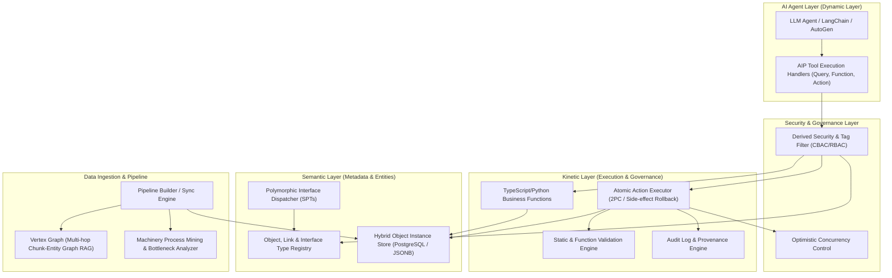

# Local Codebase Ontology Engine Design Specification (ONTOLOGY_ENGINE_DESIGN_V2.md)

This document is the official, production-ready system design specification for building a local **Palantir Foundry and AIP-compliant Ontology Engine** in Python/FastAPI/SQLAlchemy/Pydantic environments.

---

## 1. Core Architecture



---

## 2. Complete DB Schema & Data Model (SQLAlchemy ORM)

Supports **Hybrid Schema (Relational Metadata + JSONB Properties)**, **Composite Keys**, **Polymorphic Interfaces**, **Link Type Metadata**, and **Multi-Modal Data Types (Vectors, Structs, Arrays)**.

```python
from datetime import datetime
from enum import Enum
from typing import Any, Dict, List, Optional
from sqlalchemy import (
    Column, DateTime, ForeignKey, Index, Integer, String, Table, JSON, Float, Boolean, Text, UniqueConstraint
)
from sqlalchemy.orm import declarative_base, relationship

Base = declarative_base()

class DataType(str, Enum):
    STRING = "STRING"
    INTEGER = "INTEGER"
    DOUBLE = "DOUBLE"
    BOOLEAN = "BOOLEAN"
    TIMESTAMP = "TIMESTAMP"
    GEO_JSON = "GEO_JSON"
    TIME_SERIES_REF = "TIME_SERIES_REF"
    MEDIA_REF = "MEDIA_REF"
    ARRAY = "ARRAY"
    STRUCT = "STRUCT"
    VECTOR = "VECTOR"  # Array of floats for embeddings

class LinkCardinality(str, Enum):
    ONE_TO_ONE = "ONE_TO_ONE"
    ONE_TO_MANY = "ONE_TO_MANY"
    MANY_TO_MANY = "MANY_TO_MANY"

# 1. Object Type Metadata Definition
class ObjectTypeModel(Base):
    __tablename__ = "meta_object_types"

    id = Column(String(64), primary_key=True)  # e.g., "Aircraft", "MaintenanceAlert"
    display_name = Column(String(128), nullable=False)
    description = Column(Text, nullable=True)
    primary_key_properties = Column(JSON, nullable=False)  # List of PK property names (Composite PK support)
    title_key_property = Column(String(64), nullable=False)
    created_at = Column(DateTime, default=datetime.utcnow)

    properties = relationship("PropertyTypeModel", back_populates="object_type")
    interface_mappings = relationship("InterfaceMappingModel", back_populates="object_type")

# 2. Property Metadata Definition
class PropertyTypeModel(Base):
    __tablename__ = "meta_property_types"

    id = Column(Integer, primary_key=True, autoincrement=True)
    object_type_id = Column(String(64), ForeignKey("meta_object_types.id"), nullable=False)
    property_name = Column(String(64), nullable=False)
    data_type = Column(String(32), nullable=False)  # DataType Enum
    is_required = Column(Boolean, default=False)
    security_tag = Column(String(64), default="PUBLIC")  # e.g., PUBLIC, CONFIDENTIAL, RESTRICTED

    object_type = relationship("ObjectTypeModel", back_populates="properties")

    __table_args__ = (
        UniqueConstraint("object_type_id", "property_name", name="uq_obj_prop"),
    )

# 3. Polymorphic Interface Definitions & Shared Property Types (SPTs)
class SharedPropertyTypeModel(Base):
    __tablename__ = "meta_shared_property_types"

    id = Column(String(64), primary_key=True)  # e.g., "spt.asset.status"
    display_name = Column(String(128), nullable=False)
    data_type = Column(String(32), nullable=False)
    description = Column(Text, nullable=True)

class InterfaceModel(Base):
    __tablename__ = "meta_interfaces"

    id = Column(String(64), primary_key=True)  # e.g., "Interface_Asset"
    display_name = Column(String(128), nullable=False)
    description = Column(Text, nullable=True)

class InterfaceMappingModel(Base):
    __tablename__ = "meta_interface_mappings"

    id = Column(Integer, primary_key=True, autoincrement=True)
    interface_id = Column(String(64), ForeignKey("meta_interfaces.id"), nullable=False)
    object_type_id = Column(String(64), ForeignKey("meta_object_types.id"), nullable=False)
    spt_id = Column(String(64), ForeignKey("meta_shared_property_types.id"), nullable=False)
    mapped_property_name = Column(String(64), nullable=False)  # Property in ObjectType representing the SPT

    object_type = relationship("ObjectTypeModel", back_populates="interface_mappings")

# 4. Link Type Metadata Definition
class LinkTypeModel(Base):
    __tablename__ = "meta_link_types"

    id = Column(String(64), primary_key=True)  # e.g., "aircraft_maintenance_alert"
    source_object_type_id = Column(String(64), ForeignKey("meta_object_types.id"), nullable=False)
    target_object_type_id = Column(String(64), ForeignKey("meta_object_types.id"), nullable=False)
    cardinality = Column(String(32), nullable=False)  # LinkCardinality Enum
    source_display_name = Column(String(128), nullable=False)
    target_display_name = Column(String(128), nullable=False)

# 5. Object Instance Real-Time Storage
class ObjectInstanceModel(Base):
    __tablename__ = "data_object_instances"

    instance_id = Column(String(128), primary_key=True)  # Primary Key Hash or UUID
    object_type_id = Column(String(64), ForeignKey("meta_object_types.id"), nullable=False)
    properties = Column(JSON, nullable=False)  # Key-Value Pair of Properties
    version = Column(Integer, default=1, nullable=False)  # Optimistic Locking
    created_at = Column(DateTime, default=datetime.utcnow)
    updated_at = Column(DateTime, default=datetime.utcnow, onupdate=datetime.utcnow)

    __table_args__ = (
        Index("idx_obj_type", "object_type_id"),
    )

# 6. Link Instance Real-Time Storage
class LinkInstanceModel(Base):
    __tablename__ = "data_link_instances"

    id = Column(Integer, primary_key=True, autoincrement=True)
    link_type_id = Column(String(64), ForeignKey("meta_link_types.id"), nullable=False)
    source_instance_id = Column(String(128), nullable=False)
    target_instance_id = Column(String(128), nullable=False)
    created_at = Column(DateTime, default=datetime.utcnow)

    __table_args__ = (
        Index("idx_link_src_tgt", "source_instance_id", "target_instance_id"),
        UniqueConstraint("link_type_id", "source_instance_id", "target_instance_id", name="uq_link_inst"),
    )

# 7. Kinetic Layer Action Audit Log & Event Sourcing
class ActionAuditLogModel(Base):
    __tablename__ = "kinetic_action_audit_logs"

    log_id = Column(String(64), primary_key=True)
    action_type = Column(String(64), nullable=False)
    actor_id = Column(String(64), nullable=False)
    target_object_id = Column(String(128), nullable=False)
    pre_state = Column(JSON, nullable=True)
    post_state = Column(JSON, nullable=True)
    status = Column(String(32), nullable=False)  # PENDING, SUCCESS, FAILED_SIDE_EFFECT, ROLLBACK
    error_message = Column(Text, nullable=True)
    timestamp = Column(DateTime, default=datetime.utcnow)
```

---

## 3. Kinetic Layer Action Execution Engine (Atomic Side-Effects & Validations)

Includes **Atomic Transaction Commit**, **Pre-mutation Validations**, **Link Manipulations**, and **Optimistic Concurrency Control**.

```python
import uuid
from typing import Dict, Any, Optional, List

class KineticValidationError(Exception):
    pass

class KineticConcurrencyError(Exception):
    pass

class ActionExecutor:
    def __init__(self, db_session):
        self.db = db_session

    def validate_action(
        self,
        object_type_id: str,
        mutation_properties: Dict[str, Any]
    ) -> bool:
        # Fetch property constraints
        prop_defs = self.db.query(PropertyTypeModel).filter_by(object_type_id=object_type_id).all()
        prop_dict = {p.property_name: p for p in prop_defs}

        for k, v in mutation_properties.items():
            if k in prop_dict:
                p_def = prop_dict[k]
                if p_def.is_required and v is None:
                    raise KineticValidationError(f"Property '{k}' is required.")
        return True

    def apply_action(
        self,
        action_type: str,
        actor_id: str,
        target_object_id: str,
        object_type_id: str,
        mutation_properties: Dict[str, Any],
        expected_version: Optional[int] = None,
        link_mutations: Optional[List[Dict[str, Any]]] = None
    ) -> Dict[str, Any]:
        
        # 1. Validate Schema Constraints
        self.validate_action(object_type_id, mutation_properties)

        # 2. Fetch Instance & Verify Optimistic Lock
        instance = self.db.query(ObjectInstanceModel).filter_by(instance_id=target_object_id).first()
        pre_state = instance.properties if instance else None

        if instance and expected_version is not None:
            if instance.version != expected_version:
                raise KineticConcurrencyError(
                    f"Concurrency conflict: Current version {instance.version} != Expected {expected_version}"
                )

        # 3. Create Audit Log in PENDING Status
        audit_id = str(uuid.uuid4())
        audit_log = ActionAuditLogModel(
            log_id=audit_id,
            action_type=action_type,
            actor_id=actor_id,
            target_object_id=target_object_id,
            pre_state=pre_state,
            post_state=None,
            status="PENDING"
        )
        self.db.add(audit_log)
        self.db.flush()  # Obtain audit_log inside transaction

        try:
            # 4. Perform DB Mutations
            if not instance:
                instance = ObjectInstanceModel(
                    instance_id=target_object_id,
                    object_type_id=object_type_id,
                    properties=mutation_properties,
                    version=1
                )
                self.db.add(instance)
            else:
                instance.properties = {**instance.properties, **mutation_properties}
                instance.version += 1

            # Handle Link Mutations
            if link_mutations:
                for link in link_mutations:
                    if link.get("op") == "CREATE":
                        new_link = LinkInstanceModel(
                            link_type_id=link["link_type_id"],
                            source_instance_id=target_object_id,
                            target_instance_id=link["target_instance_id"]
                        )
                        self.db.add(new_link)
                    elif link.get("op") == "DELETE":
                        self.db.query(LinkInstanceModel).filter_by(
                            link_type_id=link["link_type_id"],
                            source_instance_id=target_object_id,
                            target_instance_id=link["target_instance_id"]
                        ).delete()

            audit_log.post_state = instance.properties
            self.db.flush()

            # 5. Execute External Side-Effects BEFORE Commit
            self._trigger_side_effects(action_type, target_object_id, mutation_properties)

            # 6. Mark Success & Final Commit
            audit_log.status = "SUCCESS"
            self.db.commit()

            return {
                "success": True,
                "audit_id": audit_id,
                "target_object_id": target_object_id,
                "new_version": instance.version
            }

        except Exception as e:
            self.db.rollback()
            # Record failed transaction attempt
            fail_log = ActionAuditLogModel(
                log_id=str(uuid.uuid4()),
                action_type=action_type,
                actor_id=actor_id,
                target_object_id=target_object_id,
                pre_state=pre_state,
                post_state=None,
                status="FAILED",
                error_message=str(e)
            )
            self.db.add(fail_log)
            self.db.commit()
            raise RuntimeError(f"Action execution aborted and rolled back: {str(e)}")

    def _trigger_side_effects(self, action_type: str, target_id: str, props: Dict[str, Any]):
        # Simulated external API call / message publish
        print(f"[Side-Effect Executing] Action: {action_type} on Target: {target_id}")
```

---

## 4. Advanced Vertex Graph Engine (Multi-Hop Graph RAG)

Combines Vector Search over text chunks with multi-hop graph expansion across `Chunk -> Entity -> Connected Chunks` to prevent AI hallucinations.

```python
from sqlalchemy import or_

class VertexChunkEntityModel(Base):
    __tablename__ = "vertex_chunk_entity_links"

    id = Column(Integer, primary_key=True, autoincrement=True)
    chunk_id = Column(String(128), nullable=False)
    chunk_text = Column(Text, nullable=False)
    vector_id = Column(String(128), nullable=True)
    entity_id = Column(String(128), nullable=False)
    entity_name = Column(String(128), nullable=False)
    relationship_type = Column(String(64), default="MENTIONS")
    confidence_score = Column(Float, default=1.0)

    __table_args__ = (
        Index("idx_vertex_chunk_entity", "chunk_id", "entity_id"),
    )

class VertexGraphRAGEngine:
    def __init__(self, db_session):
        self.db = db_session

    def query_graph_context(self, initial_chunk_ids: List[str], max_hops: int = 2) -> Dict[str, Any]:
        """
        Performs multi-hop graph traversal starting from seed vector-search chunks.
        Expands: Seed Chunks -> Entities -> Connected Chunks -> Entities
        """
        visited_chunks = set(initial_chunk_ids)
        visited_entities = set()
        subgraph_nodes = []
        subgraph_edges = []

        current_chunk_ids = list(initial_chunk_ids)

        for hop in range(max_hops):
            if not current_chunk_ids:
                break

            # Find all entities linked to current chunks
            links = self.db.query(VertexChunkEntityModel).filter(
                VertexChunkEntityModel.chunk_id.in_(current_chunk_ids)
            ).all()

            next_chunk_ids = []
            for link in links:
                subgraph_nodes.append({
                    "chunk_id": link.chunk_id,
                    "text": link.chunk_text,
                    "entity": link.entity_name
                })
                subgraph_edges.append({
                    "from": link.chunk_id,
                    "to": link.entity_id,
                    "rel": link.relationship_type
                })
                visited_entities.add(link.entity_id)

            # Find secondary chunks connected to discovered entities
            if visited_entities:
                sec_links = self.db.query(VertexChunkEntityModel).filter(
                    VertexChunkEntityModel.entity_id.in_(list(visited_entities)),
                    ~VertexChunkEntityModel.chunk_id.in_(list(visited_chunks))
                ).all()

                for sec in sec_links:
                    visited_chunks.add(sec.chunk_id)
                    next_chunk_ids.append(sec.chunk_id)

            current_chunk_ids = next_chunk_ids

        return {
            "retrieved_chunk_count": len(visited_chunks),
            "discovered_entity_count": len(visited_entities),
            "subgraph_nodes": subgraph_nodes,
            "subgraph_edges": subgraph_edges
        }
```

---

## 5. Machinery Process Mining Analyzer & Anomaly Detector

Calculates transition matrices, lead-time standard deviations ($\Delta t > 2\sigma$), and triggers alerts for process bottlenecks.

```python
import pandas as pd
import numpy as np
from typing import Dict, List, Any

def analyze_process_machinery(log_records: List[Dict[str, Any]]) -> Dict[str, Any]:
    """
    Analyzes event logs for process variants, bottleneck detection (> 2 stddev), and SLA breaches.
    """
    df = pd.DataFrame(log_records)
    df["timestamp"] = pd.to_datetime(df["timestamp"])
    df = df.sort_values(by=["process_id", "timestamp"])

    df["next_state"] = df.groupby("process_id")["state"].shift(-1)
    df["next_timestamp"] = df.groupby("process_id")["timestamp"].shift(-1)
    df["duration_sec"] = (df["next_timestamp"] - df["timestamp"]).dt.total_seconds()

    transitions = df.dropna(subset=["next_state"])

    # Group by transition pair
    summary = transitions.groupby(["state", "next_state"]).agg(
        transition_count=("process_id", "count"),
        avg_duration_sec=("duration_sec", "mean"),
        std_duration_sec=("duration_sec", "std")
    ).reset_index()

    summary["std_duration_sec"] = summary["std_duration_sec"].fillna(0)

    # Flag Bottlenecks (Where avg_duration > overall mean + 2 * std)
    overall_mean = transitions["duration_sec"].mean()
    overall_std = transitions["duration_sec"].std()
    threshold = overall_mean + (2 * overall_std if not np.isnan(overall_std) else 0)

    summary["is_bottleneck"] = summary["avg_duration_sec"] > threshold

    return {
        "overall_mean_sec": overall_mean,
        "bottleneck_threshold_sec": threshold,
        "transition_matrix": summary.to_dict(orient="records")
    }
```

---

## 6. Production AIP Tool Binding Schemas & Execution Handlers

### 6.1 `QueryObjects` Rich Filter Tool Spec
```json
{
  "name": "query_objects",
  "description": "Explores objects in the Palantir Ontology using filter trees, vector search, sorting, and security context.",
  "parameters": {
    "type": "object",
    "properties": {
      "actor_id": { "type": "string", "description": "ID of user/agent making query" },
      "object_type_id": { "type": "string", "description": "Target Object Type" },
      "filters": {
        "type": "object",
        "description": "Filter tree JSON e.g. {'and': [{'property': 'status', 'op': 'eq', 'value': 'OPEN'}]}"
      },
      "vector_query": { "type": "string", "description": "Semantic vector search query string" },
      "sort_by": { "type": "string", "description": "Property name to sort by" },
      "limit": { "type": "integer", "default": 10 }
    },
    "required": ["actor_id", "object_type_id"]
  }
}
```

### 6.2 Python Execution Handler for `QueryObjects`
```python
def handle_query_objects(db_session, actor_roles: List[str], payload: Dict[str, Any]) -> List[Dict[str, Any]]:
    object_type_id = payload["object_type_id"]
    actor_id = payload["actor_id"]
    limit = payload.get("limit", 10)

    # 1. Fetch Property Security Tags
    properties = db_session.query(PropertyTypeModel).filter_by(object_type_id=object_type_id).all()
    restricted_props = {p.property_name for p in properties if p.security_tag == "CONFIDENTIAL" and "ADMIN" not in actor_roles}

    # 2. Query Instances
    query = db_session.query(ObjectInstanceModel).filter_by(object_type_id=object_type_id)
    instances = query.limit(limit).all()

    # 3. Apply Column Security Masking
    results = []
    for inst in instances:
        masked_props = {k: (None if k in restricted_props else v) for k, v in inst.properties.items()}
        results.append({
            "instance_id": inst.instance_id,
            "object_type_id": inst.object_type_id,
            "version": inst.version,
            "properties": masked_props
        })

    return results
```
